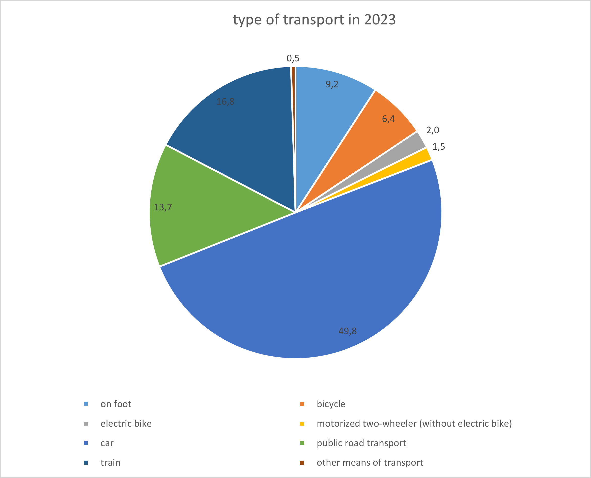
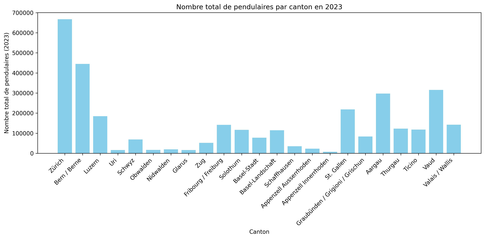

# Project of Data Visualization (COM-480)

# Swiss Pendulum

| Student's name | SCIPER |
| -------------- | ------ |
| Romain Lattion | 347395 |
| Jadd Ali Larbi | 327250 |
| Corentin Barut | 329702 |

[Milestone 1](#milestone-1) • [Milestone 2](#milestone-2) • [Milestone 3](#milestone-3)

## Milestone 1 (21st March, 5pm)

Switzerland’s daily commuters form the backbone of its mobility system, navigating a landscape of efficient trains, winding alpine roads, and bustling urban hubs. Using Swiss Federal Statistical Office (OFS) data, our project visualizes these flows, exploring how geography, transport modes, and time shape commuting patterns.

### Datasets

We chose OFS datasets because they are collected in Switzerland, offering the most comprehensive and trustworthy data on our topic, and are freely accessible. Currently, we mainly rely on three complementary datasets:

- Dataset on the number of commuters per canton (2010-2023). Check [here](/datasets/Commuters_per_canton.xlsx).
- Dataset on commuters' means of transport (1990 + 2000 + 2010-2023).. Check [here](/datasets/Commuters_means_of_transport.xlsx).
- Dataset on commuters' travel distance and time (1990 + 2000 + 2010-2023). Check [here](/datasets/Commuters_travel_time_distance.xlsx).

We’re also keen to explore additional datasets to enrich our visualizations with correlated insights. Below are potential datasets that could enhance our work:
  
- Dataset on the proportion of commuters and their types of journeys (2018-2023). Check [here](/datasets/Commuters_overview.xlsx).
- Dataset on commuters by municipality of residence and municipality of place of work (2010 + 2014 + 2018). Check [here](/datasets/Commuters_communes.xlsx).

The data quality is generally good, as it originates from an official source. However, we need to:
1.	Harmonize the names of municipalities (some have merged over the years).
2.	Check for any duplicates or missing values.
3.	Consolidate the different years into coherent structures for comparison.
Although the dataset is quite large, it is still suitable for interactive visualizations. We plan to display the flows on a map and use “dynamic bar charts” (or “race charts”) to show how the number of journeys or distances evolve over time in various cantons and municipalities.

### Problematic

Our visualization project examines Swiss commuter mobility, focusing on how commuters move across cantons, their transport choices, and travel patterns over time. The main axis is to map commuter flows, mode preferences (car vs. public transport), and regional disparities (urban vs. alpine).

There are three key points of interest:
1.	A global understanding of trends (national-level evolution).
2.	Regional comparisons (differences between cantons and municipalities).
3.	Impact on public policies: transport infrastructure, urban planning, etc.
Our target audience includes researchers (in urban planning and mobility), public decision-makers (territorial development), and anyone curious to see in a simple and interactive way how Swiss residents commute to work. The strength of this project lies in the ability to animate and contextualize these data over time, rather than simply showing static maps or tables.

### Exploratory Data Analysis

We conducted initial research and plotting to explore the dataset’s scope and potential applications.

  <figure>
    
    <figcaption>Breakdown of means of transport to work in 2023 </figcaption>
  </figure>

  <figure>
    
    <figcaption>Total number of commuters per canton in 2023  </figcaption>
  </figure>

### Related work

OFS commuter data has been used in reports like "Mobility in Switzerland" (bfs.admin.ch), with static tables on mode shares or canton flows. 

Our approach is original by transforming OFS stats into dynamic visuals, interactive flow maps and time-series emphasizing where and how pendulaires move, not just counts. Unlike OFS’s text-heavy outputs, we’ll animate commuter streams (e.g., Zurich-Bern) and highlight geographic quirks (alpine vs. urban).

What sets our approach apart:
1.	A unified dataset that brings all this information together, making it easier to visualize than other sources.
2.	A “race chart” that shows chronological evolution (for instance, the top 10 cantons with the highest commuter flow and how they “compete” over time).
3.	An interactive map that not only offers geographical visualization but also allows filtering (by canton or focusing on specific years).
4.	A consolidation of different indicators (number of journeys, distance, time, mode of transport) in a single tool, providing a comprehensive and comparative view.
We draw inspiration from the popular “bar chart races” on the internet (for example, those illustrating the changing valuations of companies over time) and from interactive maps built with Leaflet or Mapbox. These approaches are well-suited to the temporal depth of our dataset and will help highlight the diverse situations in different cantons.

  <figure>
    
    <figcaption><a href="https://www.esri.com/arcgis-blog/products/arcgis-online/data-management/pump-up-your-pop-ups-with-arcade-and-the-living-atlas/">Example of map and pop up window. Source: esri</a></figcaption>
  </figure>

  <figure>
    
    <figcaption><a href="https://www.amcharts.com/demos/bar-chart-race/">Example of bar race chart. Source: AMcharts</a></figcaption>
  </figure>

  <figure>
    
    <figcaption><a href="https://www.atlas.bfs.admin.ch/maps/13/fr/17867_17864_3134_3114/27632.html">Example of a Canton divided Swiss map. Source: BFS</a></figcaption>
  </figure>

## Milestone 2 (18th April, 5pm)

10% of the final grade
Two A4 pages describing the project goal.
• Include sketches of the vizualiation you want to make in your final product.
• List the tools that you will use for each visualization and which (past or future)
lectures you will need.
• Break down your goal into independent pieces to implement. Try to design a
core visualization (minimal viable product) that will be required at the end.
Then list extra ideas (more creative or challenging) that will enhance the
visualization but could be dropped without endangering the meaning of the
project.
Functional project prototype review.
• You should have an initial website running with the basic skeleton of the
visualization/widgets.

Pieces :

Map
Race chart of cantons
Mode of transportation
Time and distance

## Milestone 2 (18th April, 5pm)

### Project Goal

The Swiss Pendulum project aims to create an interactive web-based visualization platform that illustrates the dynamics of commuter mobility across Switzerland, leveraging comprehensive datasets from the Swiss Federal Statistical Office (OFS). Our goal is to provide an engaging and informative experience for researchers, policymakers, and the general public by visualizing commuter flows, transport mode preferences, travel times, and distances across cantons and municipalities from 2010 to 2023. The visualizations will highlight temporal trends, regional disparities, and the interplay between geography and mobility, offering insights into Switzerland’s commuting patterns and their implications for urban planning and transport infrastructure.

The platform will feature a minimal viable product (MVP) comprising four core visualizations: an interactive map, a race chart, a transport mode comparison, and a clock-based time-distance plot. These will be enhanced with creative and challenging extensions, such as real-time transport data integration and advanced filtering, to enrich user interaction without compromising the project’s core functionality. Sketches of the visualizations will be provided separately.

### Tools and Lectures

\[To be filled with specific tools and lectures from the course literature.\]

### Breakdown of Visualization Components

Our project is divided into four independent visualization components, each addressing a distinct aspect of commuter mobility. Below, we outline the core MVP for each component and list additional enhancements that could be implemented to elevate the visualizations, prioritized to ensure the MVP is achievable while allowing flexibility for creative extensions.

#### 1. Interactive Commuter Flow Map

**Core MVP**: An interactive map displaying Swiss cities as dots, with dot radius proportional to the number of incoming and outgoing commuters. Users can select a departure and arrival city to view detailed journey information, including commuter volume, drawn from the OFS datasets (`Commuters_per_canton.xlsx`, `Commuters_communes.xlsx`). The map will support basic filtering by canton and year (2010–2023).

**Implementation Details**:

- **Data**: Aggregated commuter counts by municipality and canton, harmonized to account for municipal mergers.
- **Visualization**: A Leaflet or Mapbox-based map with scalable dots and pop-up windows for journey details.
- **Interactivity**: Dropdown menus or clickable city markers for selecting departure/arrival cities, with a summary panel displaying journey statistics.

**Enhancements** (Optional):

- Integrate CFF (Swiss Federal Railways) data via API to display train schedules for selected routes, enhancing real-world applicability.
- Incorporate Google Maps API to visualize traffic congestion patterns for car-based commutes, adding context to mode choice.
- Add animated flow lines between cities to dynamically represent commuter streams, with thickness proportional to volume.
- Enable filtering by transport mode (e.g., show only train commuters) to cross-reference with the transport mode dataset.

**Challenges**:

- Harmonizing municipal data across years due to mergers.
- Ensuring smooth performance with large datasets for real-time interaction.
- Securing API access for CFF or Google Maps data within project constraints.

#### 2. Canton Race Chart

**Core MVP**: A dynamic “bar chart race” visualizing the ranking of cantons by total commuter volume from 2010 to 2023, using data from `Commuters_per_canton.xlsx`. The chart will animate yearly changes, highlighting shifts in commuter activity across Switzerland.

**Implementation Details**:

- **Data**: Yearly commuter counts per canton, preprocessed for consistency.
- **Visualization**: A horizontal bar chart with bars transitioning smoothly between years, built using D3.js or a similar library.
- **Interactivity**: Play/pause controls and a slider to jump to specific years.

**Enhancements** (Optional):

- Add a secondary metric toggle (e.g., switch between commuter volume and average travel distance) to diversify insights, using `Commuters_travel_time_distance.xlsx`.
- Include a “highlight” feature where users can select a canton to track its ranking over time with a distinct color or annotation.
- Incorporate a companion line chart below the race chart to show the selected canton’s commuter growth rate, providing deeper context.
- Extend the race chart to municipalities (top 10–20) for a more granular view, using `Commuters_communes.xlsx`.

**Challenges**:

- Limited data variety (only commuter volume) may make the race chart repetitive; enhancements like toggling metrics can address this.
- Ensuring smooth animations without performance lags for web-based rendering.

#### 3. Transport Mode Comparison

**Core MVP**: A bar chart displaying the distribution of transport modes (e.g., car, train, bike) used by commuters in 2023, sourced from `Commuters_means_of_transport.xlsx`. Users can select multiple modes to compare their shares side-by-side in a standard bar or stacked bar chart.

**Implementation Details**:

- **Data**: Transport mode shares for 2023, with potential extension to other years.
- **Visualization**: A static bar chart with dynamic updates based on user selections, built using Chart.js or D3.js.
- **Interactivity**: Checkboxes or a multi-select dropdown for choosing transport modes, with real-time chart updates.

**Enhancements** (Optional):

- Add a time slider to animate mode share changes from 1990 to 2023, showing historical shifts (e.g., rise in public transport).
- Include a pie chart toggle for users preferring a proportional view of mode shares.
- Overlay regional filters (e.g., urban vs. rural cantons) to compare mode preferences across geographies, using `Commuters_per_canton.xlsx`.
- Visualize mode-specific environmental impact (e.g., CO2 emissions per mode) if supplementary data becomes available.

**Challenges**:

- Ensuring clarity when comparing multiple modes, especially with overlapping data.
- Handling sparse data for earlier years (e.g., 1990) if extending to historical trends.

#### 4. Time and Distance Clock

**Core MVP**: A novel clock-based visualization representing commuter travel time and distance, using data from `Commuters_travel_time_distance.xlsx`. Travel time buckets (e.g., 0–15 min, 15–30 min) are mapped to a circular clock, with a needle sweeping from 0 to 360 degrees. An outer ring grows radially to represent the number of commuters in each time bucket, resetting at the start of each bucket.

**Implementation Details**:

- **Data**: Binned travel time and distance data, aggregated by commuter counts.
- **Visualization**: A custom SVG-based clock using D3.js, with a radial bar or arc for the outer ring and a rotating needle.
- **Interactivity**: Hover or click on time buckets to display exact commuter counts and average distances.

**Enhancements** (Optional):

- Add a dual-ring system to simultaneously show distance buckets (e.g., 0–10 km, 10–20 km) alongside time, with color differentiation.
- Enable year-based filtering to compare time/distance distributions across 2010–2023.
- Introduce a “play” button to animate the needle and ring growth for a dynamic storytelling effect.
- Link the clock to the map, highlighting cities with similar time/distance profiles when a bucket is selected.

**Challenges**:

- Designing an intuitive radial visualization that avoids clutter with multiple data layers.
- Balancing aesthetic appeal with data clarity for non-technical audiences.

### Functional Prototype Status

We have developed an initial website prototype that serves as the skeleton for our visualization platform. The prototype includes:

- A basic HTML/CSS structure with a responsive layout for hosting visualizations.
- Placeholder sections for the map, race chart, transport mode chart, and time-distance clock.
- Preliminary data preprocessing scripts (in Python or JavaScript) to clean and harmonize OFS datasets, addressing municipal name inconsistencies and missing values.
- A basic Leaflet map displaying Swiss cantons with static commuter data for 2023, as a proof-of-concept for the interactive map.
- A simple D3.js bar chart for transport modes in 2023, with toggle functionality for mode selection.

The prototype is functional but lacks full interactivity and polished visuals, which will be refined in Milestone 3. Current challenges include optimizing data loading for the map and ensuring cross-browser compatibility for animations.

### Prioritization and Feasibility

The MVP ensures a cohesive and meaningful visualization of Swiss commuter mobility, focusing on commuter flows (map), temporal trends (race chart), mode preferences (bar chart), and travel patterns (clock). These components are independent, allowing parallel development and iterative refinement. The enhancements are designed as modular additions, prioritized based on impact and feasibility:

- High-priority enhancements: CFF/Google Maps API integration for the map, metric toggling for the race chart, and historical trends for the transport mode chart.
- Lower-priority enhancements: Environmental impact data, municipal-level race charts, and dual-ring clock visuals, which depend on additional data or complex implementation.

By maintaining a robust MVP, we ensure the project’s core objectives are met while leaving room for creative extensions to enhance user engagement and analytical depth.

## Milestone 3 (30th May, 5pm)

**80% of the final grade**

## Late policy

- < 24h: 80% of the grade for the milestone
- < 48h: 70% of the grade for the milestone

