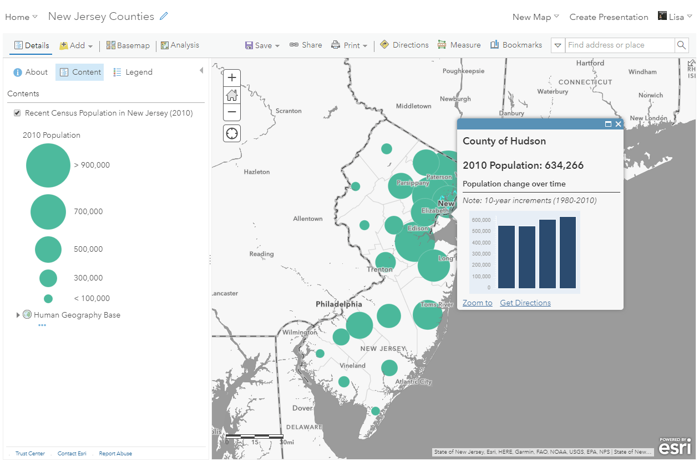
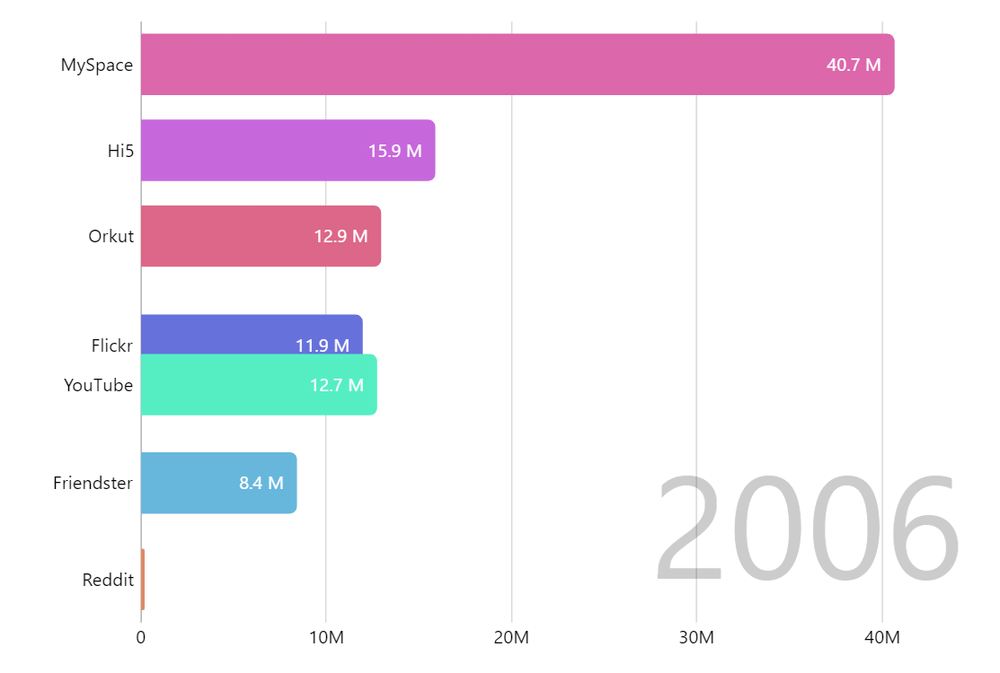
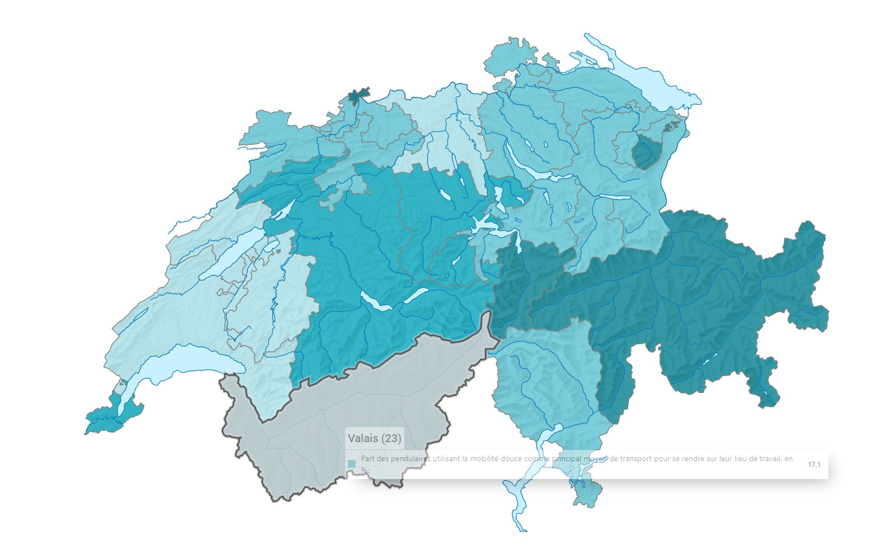

# Project of Data Visualization (COM-480)

| Student's name | SCIPER |
| -------------- | ------ |
| Romain Lattion | 347395 |
| Jadd Ali Larbi | 327250 |
| Corentin Barut | 329702 |

[Milestone 1](#milestone-1) • [Milestone 2](#milestone-2) • [Milestone 3](#milestone-3)

## Milestone 1 (21st March, 5pm)

  <figure>
    
    <figcaption><a href="https://www.esri.com/arcgis-blog/products/arcgis-online/data-management/pump-up-your-pop-ups-with-arcade-and-the-living-atlas/">Example of map and pop up window. Source: esri</a></figcaption>
  </figure>

  <figure>
    
    <figcaption><a href="https://www.amcharts.com/demos/bar-chart-race/">Example of bar race chart. Source: AMcharts</a></figcaption>
  </figure>

  <figure>
    
    <figcaption><a href="https://www.atlas.bfs.admin.ch/maps/13/fr/17867_17864_3134_3114/27632.html">Example of bar race chart. Source: AMcharts</a></figcaption>
  </figure>

Switzerland’s pendulaires—daily commuters—form the backbone of its mobility system, navigating a landscape of efficient trains, winding alpine roads, and bustling urban hubs. Using Swiss Federal Statistical Office (OFS) data, our project visualizes these flows, exploring how geography, transport modes, and time shape commuting patterns. We aim to illuminate the rhythms of Swiss life, offering insights for policymakers and a window into pendulaire experiences for all.

### Dataset

We chose OFS datasets because they are collected in Switzerland, offering the most comprehensive and trustworthy data on our topic, and are freely accessible. Currently, we mainly rely on three complementary datasets:

-
-
-

We’re also keen to explore additional datasets to enrich our visualizations with correlated insights. Below are potential datasets that could enhance our work:
  
-
-
-

OFS data is high-quality, standardized (CSV/XLS), and publicly available, requiring minimal scraping. However, preprocessing is needed: PEND lacks GPS but needs aggregation (e.g., canton-level flows); MTMC has detailed samples but requires filtering for commuters and handling missing values (e.g., unreported modes). Infrastructure data needs spatial joining with commuter stats. Cleaning involves normalizing units (km/minutes), deduplicating entries, and aligning years (e.g., 2020-2022). These datasets suit visualization goals with moderate effort, leveraging OFS’s reliability.

### Problematic

Our visualization project examines Swiss pendulaire mobility, focusing on how commuters move across cantons, their transport choices, and travel patterns over time. The main axis is to map commuter flows, mode preferences (car vs. public transport), and regional disparities (urban vs. alpine), answering: What defines Switzerland’s commuting landscape, and how do geography and infrastructure shape it?

The overview is an interactive tool showcasing commuter origins/destinations, trip durations, and modal splits, using OFS data. Our motivation is Switzerland’s unique mobility system—efficient trains, alpine barriers, and dense urban hubs—making pendulaire patterns a compelling story. We aim to reveal trends like Zurich’s dominance or rural car reliance, aiding transport planning. The target audience includes policymakers, urbanists, and Swiss residents interested in daily travel dynamics.

Unlike broad transport stats, we’ll spotlight commuter experiences, blending spatial flows with temporal shifts (e.g., pre/post-COVID). This offers both public engagement (intuitive maps) and practical insights (policy-relevant trends), setting it apart from static reports.

### Exploratory Data Analysis

Preprocessing OFS datasets starts with the PEND dataset: commuter flows (e.g., 1.2M daily pendulaires in 2022) need canton-level aggregation and mode categorization (car, train, etc.). The MTMC (2020) offers ~300,000 trips; we’ll filter for work-related travel (~40%), handle missing modes (~5% incomplete), and standardize distances/times. Infrastructure data (e.g., rail km) will be joined via canton codes.

Stats show: PEND reports 60% of commuters use public transport, 35% cars, 5% active modes; mean commute is 14.5 km (std. dev. 18 km), with 70% under 30 minutes. MTMC highlights Zurich’s 25% share of trips, with peak hours at 7-8 AM (20% of daily travel). Rural cantons (e.g., Uri) show 50%+ car use vs. 80% train in Geneva. Yearly data (2018-2022) suggests a 10% public transport drop post-2020.

Insights: Urban centers drive short, transit-heavy commutes; alpine areas favor longer, car-based trips. Temporal peaks strain networks, ideal for flow maps or mode-split charts. Data gaps (e.g., no GPS) limit precision but suit regional visualization.

### Related work

OFS commuter data (PEND) has been used in reports like "Mobility in Switzerland" (bfs.admin.ch), with static tables on mode shares or canton flows. The MTMC fuels academic studies (e.g., modal choice models), not visualizations. Public tools like SBB’s timetable maps focus on schedules, not pendulaire patterns.

Our approach is original by transforming OFS stats into dynamic visuals—interactive flow maps and time-series—emphasizing where and how pendulaires move, not just counts. Unlike OFS’s text-heavy outputs, we’ll animate commuter streams (e.g., Zurich-Bern) and highlight geographic quirks (alpine vs. urban). Inspirations include Tableau’s flow maps (e.g., US migration) for spatial clarity and Economist’s transit timelines for temporal depth, adapted to Switzerland’s cantonal lens.

## Milestone 2 (18th April, 5pm)

**10% of the final grade**

## Milestone 3 (30th May, 5pm)

**80% of the final grade**

## Late policy

- < 24h: 80% of the grade for the milestone
- < 48h: 70% of the grade for the milestone

