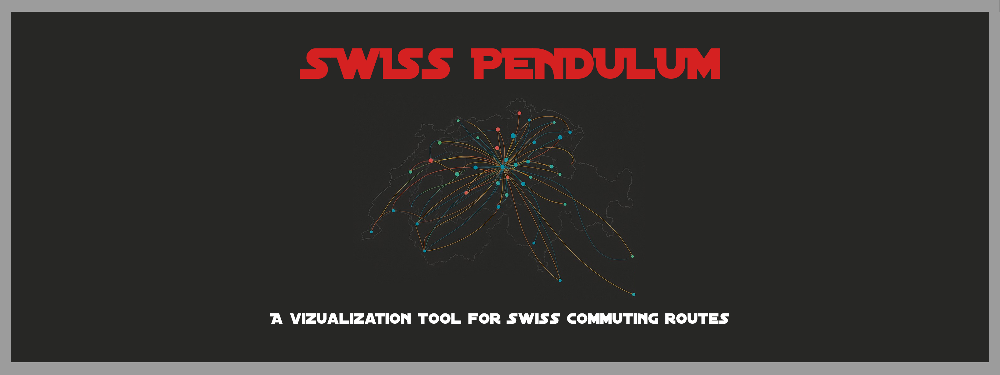

# Project of Data Visualization (COM-480)

| Student's name | SCIPER |
| -------------- | ------ |
| Romain Lattion | 347395 |
| Jadd-Ilyes Ali Larbi | 327250 |
| Corentin Barut | 329702 |

<p align="center">
  <figure>
    
  </figure>
</p>

# Swiss Pendulum

A web-based data visualization project for exploring commuter mobility patterns in Switzerland, built as part of the COM-480 Data Visualization course. The project uses datasets from the Swiss Federal Statistical Office (OFS) to create interactive visualizations, including a commuter flow map, a canton bar chart race, a transport mode comparison, and a time-distance clock.

**➡️ [Live Website](https://com-480-data-visualization.github.io/data-vizviz/)**  
**🎥 [Watch Demo on YouTube](https://www.youtube.com/watch?v=l_0hukL3RVo&ab_channel=SwissPendulum)**

## Table of Contents
- [Project Overview](#project-overview)
- [Technical Setup](#technical-setup)
  - [Prerequisites](#prerequisites)
  - [Installation](#installation)
  - [File Structure](#file-structure)
- [Usage](#usage)
  - [Running the Application](#running-the-application)
  - [Interacting with Visualizations](#interacting-with-visualizations)
- [Dependencies](#dependencies)
- [Data Sources](#data-sources)

## Project Overview
The Swiss Pendulum project visualizes commuter mobility across Switzerland, focusing on:
- **Commuter flows** between cities and cantons.
- **Transport mode preferences** (e.g., car, train, bike).
- **Travel time and distance** distributions.
- **Temporal trends** from 2010 to 2023.

The platform features four main visualizations:
1. **Interactive Commuter Flow Map**: Displays Swiss cities as proportional circles based on commuter volume, with selectable routes.
2. **Canton Bar Chart Race**: Animates the ranking of cantons by commuter volume over time.
3. **Transport Mode Comparison**: Shows the distribution of transport modes used by commuters, with filtering options.
4. **Distance Plot**: Visualizes travel distance distributions using an animated bar plot.
5. **Time Clock**: Visualizes travel time distributions using a radial clock design.

The project is hosted on [GitHub Pages](https://com-480-data-visualization.github.io/data-vizviz/) for easy access.

## Technical Setup

### Prerequisites
To run or develop the Swiss Pendulum project locally, ensure you have:
- A modern web browser (e.g., Chrome, Firefox, Edge).
- A local web server (e.g., Python's `http.server`, Node.js `http-server`, or VS Code Live Server extension) to serve the static files.
- Git for cloning the repository.
- (Optional) A code editor like VS Code for modifying the source code.

No server-side processing or backend is required, as the application is entirely client-side and uses static JSON data.

### Installation
1. **Clone the Repository**:
   ```bash
   git clone https://github.com/com-480-data-visualization/data-vizviz.git
   cd data-vizviz
   ```

2. **Serve the Application Locally**:
   Use a local web server to serve the files. For example, with Python:
   ```bash
   python -m http.server 8000
   ```
   Then, open `http://localhost:8000` in your browser.

3. **Deploy to GitHub Pages** (for maintainers):
   The project is configured to deploy automatically to GitHub Pages on pushes to the `main` branch. Ensure the repository settings enable GitHub Pages under the `Pages` section, pointing to the `main` branch.

### File Structure
```
data-vizviz/
├── datasets/                     # Preprocessed JSON data files
│   ├── pendulaire_2_js_v3.js     # Transport mode data
│   ├── pendulaire_4.js           # Commuter data per canton
│   ...                           # Other datasets
├── img/                          # Image assets for visualizations
├── bar_chart_transport_type_script.js  # Transport mode comparison logic
├── bar_chart_transport_type_style.css # Transport mode comparison styles
├── distance_script.js            # Distance visualization logic
├── distance_style.css            # Distance visualization styles
├── map_script.js                 # Map visualization logic
├── map_style.css                 # Map visualization styles
├── race_chart2.js                # Canton bar chart race logic
├── race_chart2.css               # Canton bar chart race styles
├── script_times2.js              # Time visualization logic
├── style_times2.css              # Time visualization styles
├── website_script.js             # Core website logic (scrolling, navigation)
├── website_style.css             # Core website styles
├── index.html                    # Main HTML file
├── README.md                     # This file
```

## Usage

### Running the Application
1. Access the live demo at [https://com-480-data-visualization.github.io/data-vizviz/](https://com-480-data-visualization.github.io/data-vizviz/).
2. Alternatively, run locally by following the [Installation](#installation) steps.
3. Navigate through sections (Home, Map, Commuters, Transport, Time, Distance) using the header navigation or scroll arrows.

### Interacting with Visualizations
- **Map**:
  - Select a view mode (Arrivals, Departures, Routes) and year from dropdowns.
  - Choose departure and arrival cities to see commuter flow details.
  - Zoom and pan the map to explore city-level data.
- **Commuters per Canton**:
  - Watch the animated bar chart race showing canton rankings by commuter volume.
  - Use the play/pause button and metric selector to customize the view.
- **Transport Modes**:
  - Select a year to view transport mode distributions.
  - Click bars to open a modal for comparing mode trends over time.
  - Use Start/Reset buttons to control animations.
- **Time**:
  - Use the slider or "Next Year" button to explore commuter travel time distributions.
  - Hover over time buckets to see exact counts.
- **Distance**:
  - Adjust the year slider to visualize distance distributions.
  - Compare years using the dropdown for side-by-side analysis.

## Dependencies
The project relies on the following client-side libraries, loaded via CDN:
- **D3.js (v7)**: For map rendering and data manipulation.
- **D3-geo (v1)**: For geographic projections in the map.
- **TopoJSON (v3)**: For efficient map data encoding.
- **jQuery (v3.6.0)**: For DOM manipulation and AJAX.
- **Select2 (v4.1.0)**: For enhanced dropdown menus.
- **p5.js (v1.4.2)**: For canvas-based animations (time-distance clock).
- **Chart.js (v4)**: For bar chart race and transport mode visualizations.

All dependencies are included in `index.html` via `<script>` and `<link>` tags, requiring no local installation.

## Data Sources
The visualizations use preprocessed JSON files derived from the Swiss Federal Statistical Office (OFS) datasets (see milestone 1):
- Commuters per canton (2010–2023).
- Commuters' means of transport (1990, 2000, 2010–2023).
- Commuters' travel time and distance (1990, 2000, 2010–2023).
- Additional datasets for journey types and municipality-level flows.

Data is stored in the `datasets/` folder as JSON files for fast client-side loading.


